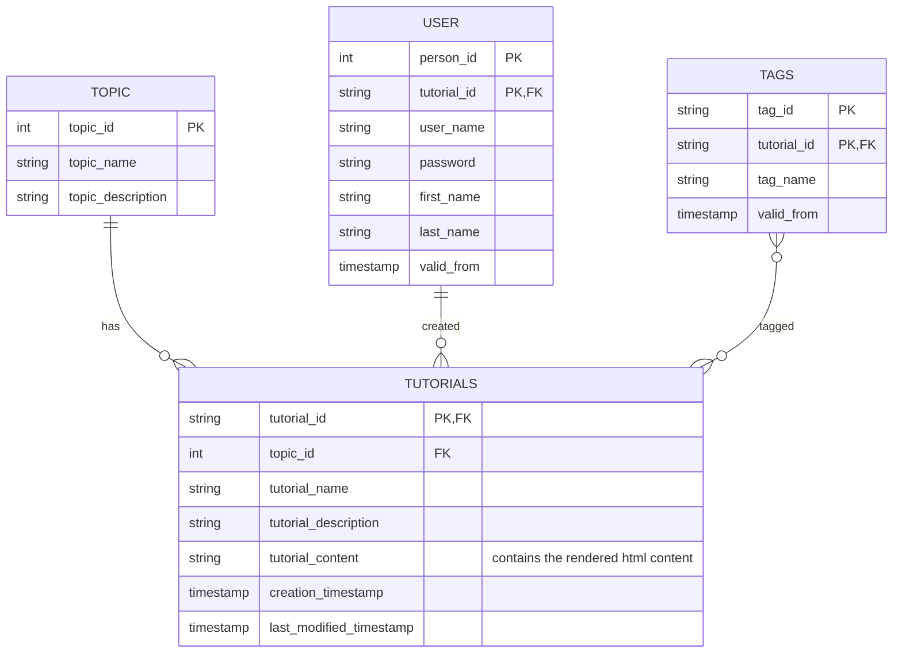

## Tech-Hub Database Model

```mermaid
erDiagram
    TOPIC {
        int topic_id PK
        string topic_name
        string topic_description
    }
    TUTORIALS {
        string tutorial_id PK, FK
        int topic_id FK
        string tutorial_name
        string tutorial_description
        string tutorial_content "contains the rendered html content"
        timestamp creation_timestamp
        timestamp last_modified_timestamp
    }
    USER {
        int person_id PK
        string tutorial_id PK, FK
        string user_name
        string password
        string first_name
        string last_name
        timestamp valid_from
    }
    TAGS {
        string tag_id PK
        string tutorial_id PK, FK
        string tag_name
        timestamp valid_from
    }
    TOPIC ||--o{ TUTORIALS: has
    USER ||--o{ TUTORIALS : created
    TAGS }o--o{ TUTORIALS : tagged
```